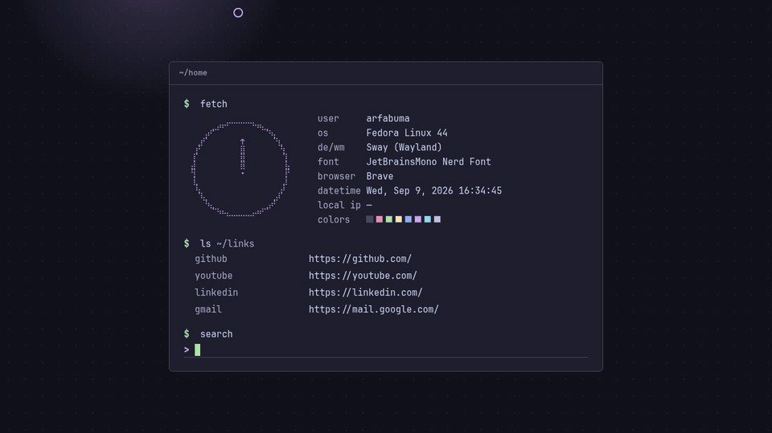

# Arfabuma New Tab

A minimal, terminal-inspired New Tab page for Brave Browser. Vanilla HTML/CSS/JS,
no dependencies, works fully offline. Built on the Catppuccin Mocha palette.



## Features

- `$ fetch` block: user, OS, DE/WM, font, browser, live clock, local IP, palette
- Braille clock: a circle whose hand points at your cursor (8 directions)
- Dot-grid background with a soft glow trailing the cursor
- `$ ls ~/links`: up to 5 recent sites from the last 7 days of history,
  with built-in defaults when history is unavailable
- `$ search`: uses the browser's default search engine (Google fallback
  when opened as a plain file for development)
- Keyboard-first: `/` focuses search, `Enter` searches, `Escape` clears
- Respects `prefers-reduced-motion` (clock hand and glow go static)

## Install

1. Open `brave://extensions`
2. Enable **Developer mode** (top right)
3. Click **Load unpacked**
4. Select this project folder

The New Tab page now shows `~/home`. The extension asks for the **History**
permission (recent links) and **Search** permission (default engine search).

## Files

```
├── manifest.json   MV3 manifest, overrides the New Tab page
├── index.html      Terminal session markup
├── style.css       Catppuccin Mocha palette + terminal UI
├── script.js       Clock, cursor glow, search, recent links, shortcuts
└── README.md
```

## Customize

All frequently changed values live at the top of `script.js`:

| Setting       | Value          |
| ------------- | -------------- |
| Username      | `USER`         |
| OS            | `OS`           |
| DE/WM         | `DE_WM`        |
| Font          | `FONT`         |
| Local IP      | `LOCAL_IP`     |
| ANSI colors   | `COLORS` array |
| Search engine | `SEARCH_URL`   |
| Default links | `LINKS` array  |
| Glow grain    | `PIXEL_GLOW_SIZE` (lower = chunkier pixels) |
| Hand deadzone | `HAND_DEADZONE` (px around clock center) |

Example:

```js
const USER = "arfabuma";
const SEARCH_URL = "https://www.google.com/search?q=";
```

After editing, reload the extension at `brave://extensions`.

## Keyboard

| Key      | Action             |
| -------- | ------------------ |
| `/`      | Focus search input |
| `Enter`  | Run search         |
| `Escape` | Clear search input |
